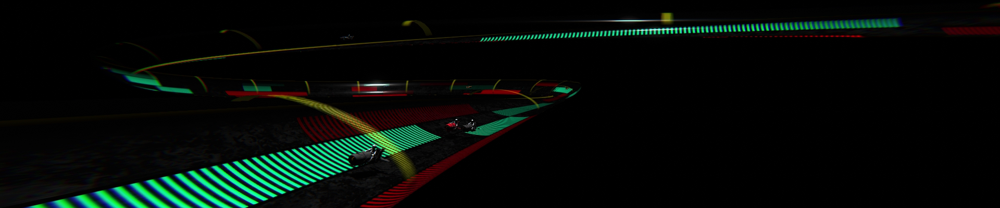

## Hover Bike Race - [Video](https://www.youtube.com/watch?v=WvSyD8VFLFg)

A reinforcement learning project made with [Unity Machine Learning Agents](https://github.com/Unity-Technologies/ml-agents) [v1.0](https://github.com/Unity-Technologies/ml-agents/releases/tag/release_1).  
Agents control throttle and steering. Driving on green stripes increases their top speed. Red stripes slow them down. Agents can detect each other, track curvature and stripe values ahead. Each agent is rewarded for speed and penalized for being passed by another one.
  
The project contains a few freely available code libs and 3D models:
  
Ciber Warrior Series -ZX by Oscar Mauricio Ulloa  
[https://sketchfab.com/3d-models/ciber-warrior-series-zx-oscar-creativo-566f7b32fa9e4fbd90a8097046b89e2e](https://sketchfab.com/3d-models/ciber-warrior-series-zx-oscar-creativo-566f7b32fa9e4fbd90a8097046b89e2e)  
[https://oscarcreativo.co/](https://oscarcreativo.co/)  
  
Hover Bike "The Rocket" by Tupps Midel  
[https://sketchfab.com/3d-models/hover-bike-the-rocket-8b2e5bfca78e41c791b4e5b5e8c04512](https://sketchfab.com/3d-models/hover-bike-the-rocket-8b2e5bfca78e41c791b4e5b5e8c04512)  
[https://www.artstation.com/tuppsmidel](https://www.artstation.com/tuppsmidel)  
  
Unity Bezier Solution by Süleyman Yasir Kula  
[https://github.com/yasirkula/UnityBezierSolution](https://github.com/yasirkula/UnityBezierSolution)  
  
Easy Buttons by Mads Bang Hoffensetz  
[https://github.com/madsbangh/EasyButtons](https://github.com/madsbangh/EasyButtons)